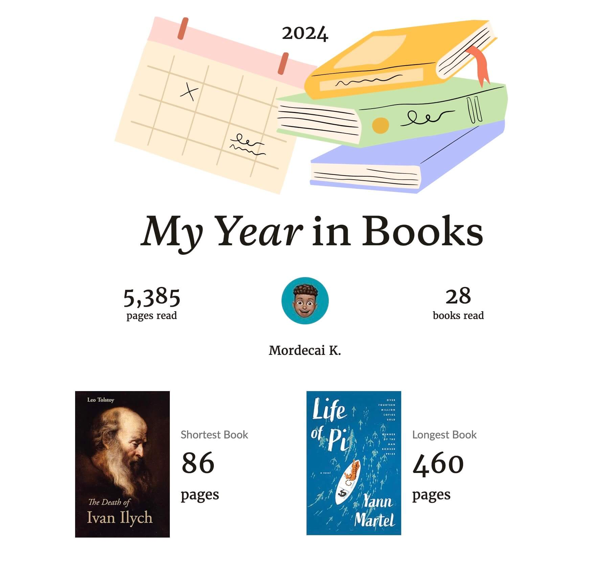
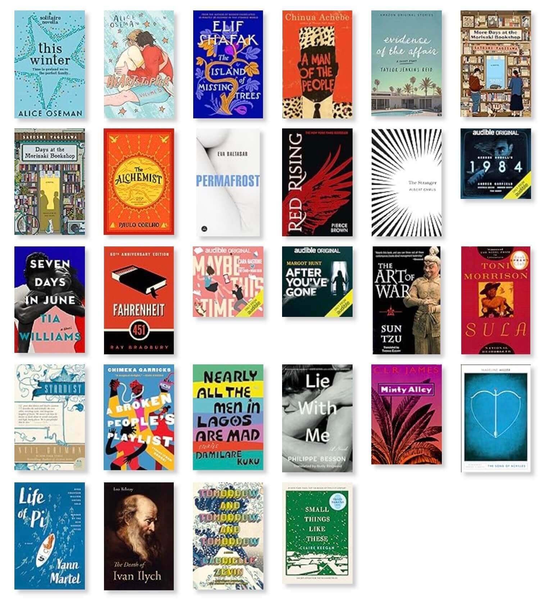
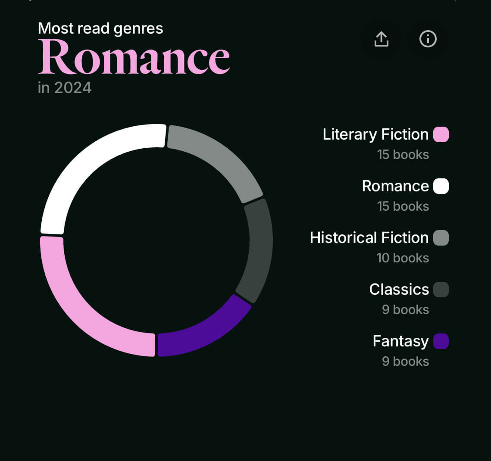
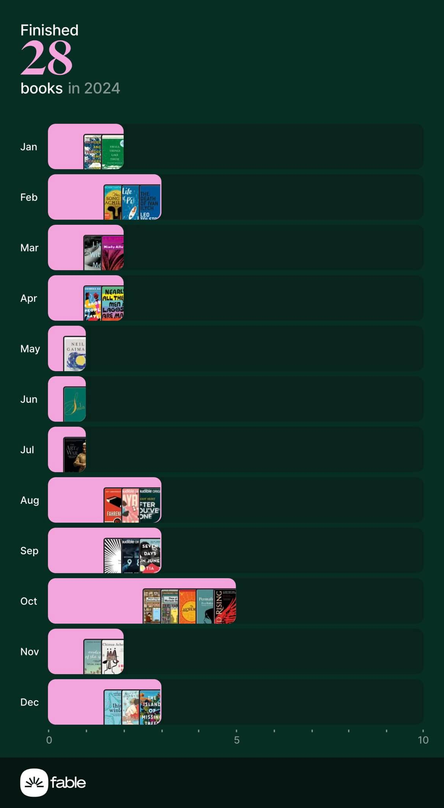

This was meant to be posted end of last year but as a result of the festivities and perhaps procrastination, here we are. 

I wrapped up the year having read 28 books with my fear of big books remaining present.
I read mostly small and medium sized books with my average page count being 192 pages.

The books that really stood out for me and I highly recommend were Madeline Miller’s _The Song of Achilles_, Philip Besson’s _Lie With Me_, Ray Bradbury’s _Fahrenheit 451_, Pierce Brown’s _Red Rising_ (which I intend to continue with the series) and Elif Shafak’s _The Island of Missing Trees_. 

A film that I find amazing and I’ve watched more than once is _Life of Pi_.
Why am I talking about a film?
Well, I was rudely surprised that it’s actually based on a book.
I read it and loved it especially the exploration of Pi’s relationship with religion which was only briefly mentioned in the film. 

Anyway, my greatest discovery in the world of texts and characters was audiobooks as a direct result of a reading slump.

As reading slumps go, I had one during a period of uncertainty mid-2024.
I wasn’t interested in anything whatsoever and I had no way of getting out of this vicious state.
Out of nowhere, the least expected item came to my rescue - House of The Dragon. 
I had never watched Game of Thrones and I wasn’t intending to.
This was down to my preconceived notions, it being eight seasons long and the meme that is the finale season but House of The Dragon was still fresh… 
I dove right in and binged season one, caught up with season two as it aired and after the final episode, I was sold on the entire Game of Thrones franchise but more so the books as well. 

A friend suggested I should get an Audible free trial to read George R.R. Martin’s _Fire & Blood_ and so I gave this a go. 
I got a wickedly nice three-month Audible Plus trial with two monthly credits. 
I ‘bought’ all the big books I’ve always wanted to read to get to them when my free trial ends cause I wasn’t intending to keep the subscription. 
With that, I finally tried out some of the free books available with my Audible Plus trial. 


I had never seriously tried audiobooks before but this got me off my reading slump. 
I listen to a lot of podcasts so this came naturally to me. 
I know some people consider audiobooks as not reading but isn’t the point to consume high quality material and if someone prefers audio then let them be.
Nevertheless, out of the need to be more attentive, my system was to listen to the books while following along the text on my Kindle and this served me well. 

I highly recommend audiobooks to anyone who has second-guessed them or if you want to get off a reading slump.

Anyhow, here are two extra screenshots to summarise my 2024 reading, you can also have a look at my [Goodreads](https://goodreads.com/insidemordecai) profile for my book ratings/reviews or my [2024 Year in Books](https://www.goodreads.com/user/year_in_books/2024/148227803).

Cheers ✌️
